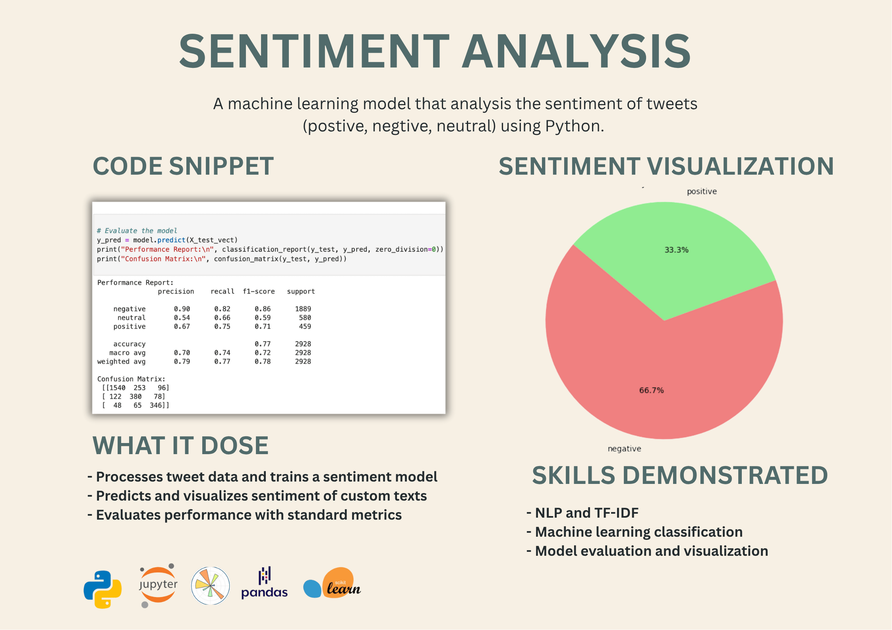
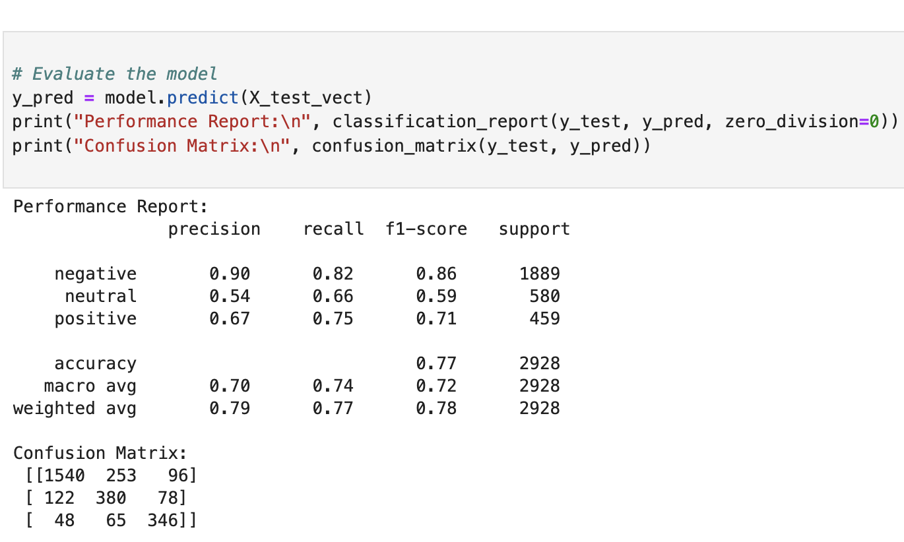
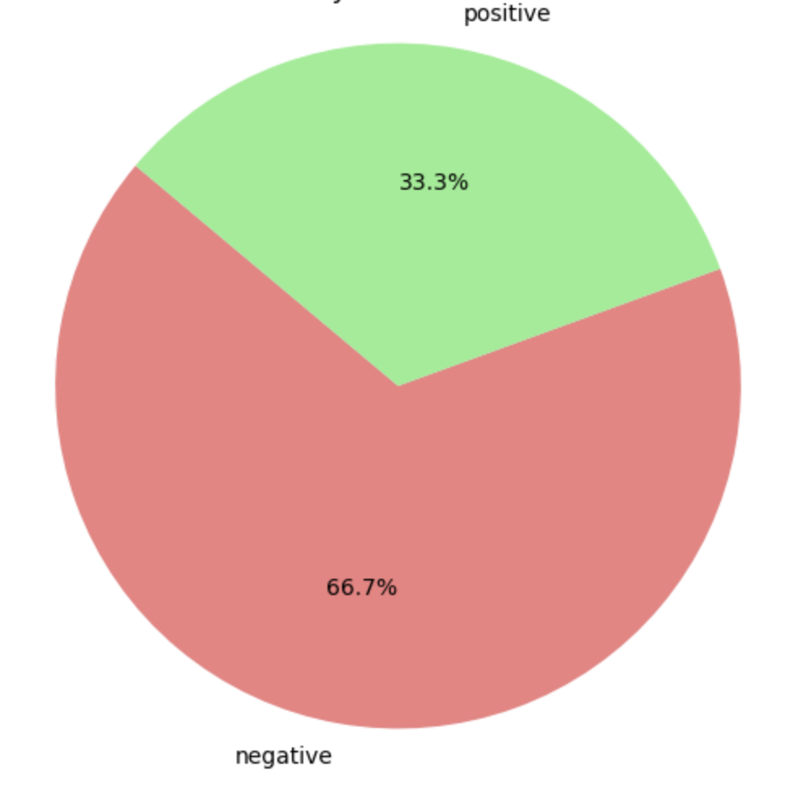

# Twitter Sentiment Analysis



A machine learning project that analyzes the sentiment of tweets (positive, negative, neutral) using Python.

## Tools Used
- Python
- Jupyter Notebook
- pandas, scikit-learn, matplotlib

## What It Does
- Loads tweet data related to US airlines
- Cleans and vectorizes the text using TF-IDF
- Trains a Logistic Regression classifier with balanced class weights
- Predicts sentiment of custom text inputs
- Displays results visually using a pie chart
- Evaluates model performance with precision, recall, and F1-score


## Skills Demonstrated
- Natural Language Processing (NLP)
- Text preprocessing with TF-IDF vectorization
- Supervised machine learning classification
- Model evaluation (classification report & confusion matrix)
- Data visualization (matplotlib pie chart)


## Accuracy
- Overall test accuracy: 77%
- Best performing class: Negative
- Classification evaluated using `classification_report` from sklearn


## Code and Results Samples

Example snippet from the code:



Sentiment distribution pie chart:



## Dataset Source
This project uses the [Twitter US Airline Sentiment dataset](https://www.kaggle.com/datasets/crowdflower/twitter-airline-sentiment) from Kaggle.


## How to Try It

1. Clone this repository or download the files  
2. Make sure `Tweets.csv` is placed in the root folder  
3. Open the `.ipynb` notebook in Jupyter  
4. Run all cells to train the model and try your own text:

```python
my_texts = ["I hate delays!", "Thanks for the smooth flight."]
